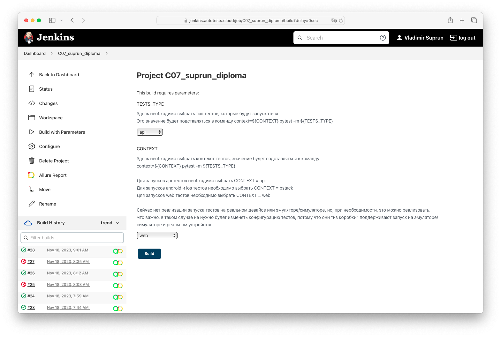
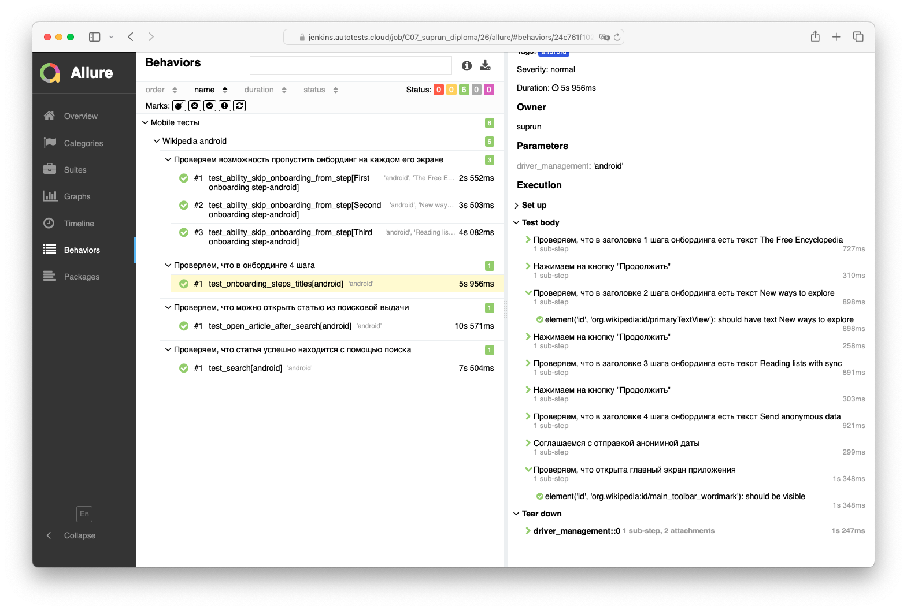
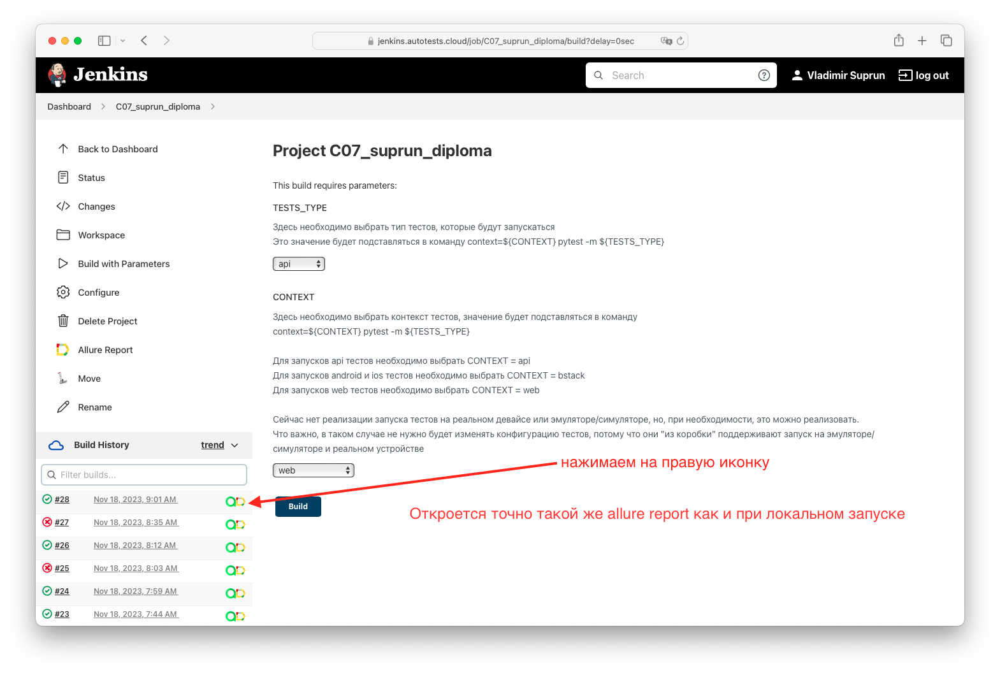
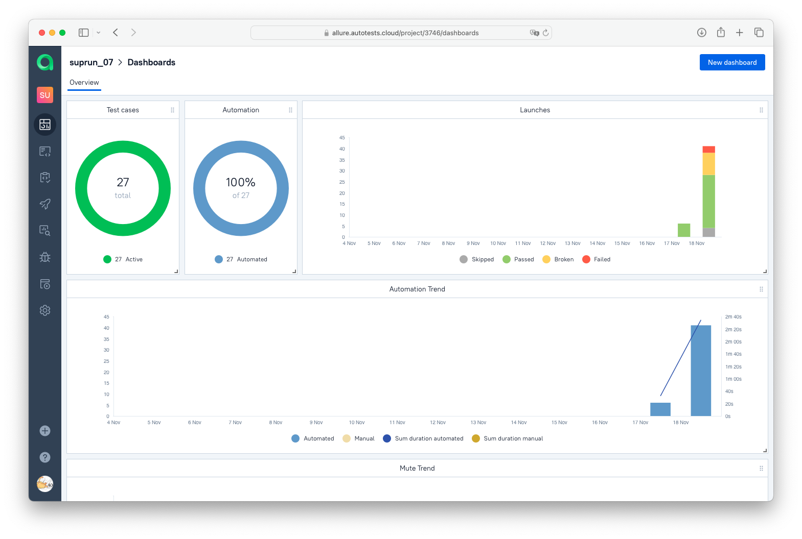
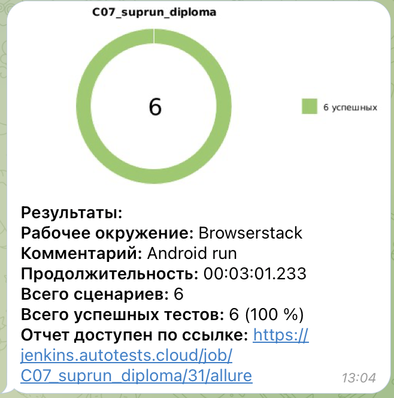

# Пример проекта мобильных автотестов

###  Используемые технологии
<p align="center">
  <code></code>
  <code></code>
  <code></code>
  <code></code>
  <code></code>
  <code></code>
  <code></code>
  <code></code>
  <code></code>
  <code></code>
</p>

## Покрываемый функционал
- Проверка полей Text Input и Text Output
- Проверка появления alert'a 
- Проверка поля поиска 
- Проверка возможности открытия статьи
- Проверка онбординга


## Запуск тестов
#### Mobile тесты можно запустить локально на реальном девайсе или эмуляторе или на [BrowserStack](https://www.browserstack.com)

### Локально
Важно! Перед запском нужно создать файл .env.bstack_credentials и указать там bstack_userName и bstack_accessKey.

Для запуска тестов локально, нужно выполнить следующие шаги
1. Склонировать репозиторий
2. Открыть проект в PyCharm
3. Ввести в териминале следующие команды
``` 
python -m venv .venv
source .venv/bin/activate
pip install -r requirements.txt
cd tests 
```
- для запуска тестов в BrowserStack 
  - На android
    ```
    context=bstack pytest -m android 
    ```
  - На ios
    ```
    context=bstack pytest -m ios 
    ```
- для запусков тестов локально 
  - на реальном устройстве android 
    ```
    context=local_real pytest -m android 
    ```
  - на эмуляторе устройства android
    ```
    context=local_emulator pytest -m android 
    ```


### С помощью [Jenkins](https://jenkins.autotests.cloud/job/C07_suprun_diploma/)
#### Для запуска автотестов необходимо:
 - Открыть [джобу](https://jenkins.autotests.cloud/job/C07_suprun_diploma/) в jenkins
 - Нажать на кнопку Build with Parameters
 - Выбрать необходимые значения параметров TESTS_TYPE и CONTEXT согласно инструкции 
 - Нажать на Build



## Отчет о прохождении тестов (Allure)
### Локально
Для получения отчета нужно ввести команду 
```
allure serve allure-results
``` 
Ниже представлен пример allure отчета 


Подробные инструкции по работе с allure можно найти по [ссылке](https://allurereport.org/docs/).
### Если тесты запускались в Jenkins
Для получения отчета нужно нажать на иконку allure report'a в строке билда  
У него будет точно такой же формат, как и при получении локально


### В проекте реализована интеграция с Allure TestsOps


### В проекте настроена отправка краткого отчета в Telegram


### При запуске тестов в BrowserStack в Allure отчет добавляется видеозапись теста
<video src="images/videos/browserstack_video_example.gif">Пример запуска теста

### По [ссылке](https://drive.google.com/file/d/1vJbZYOEBn86o7w8Ig0QB2DM3DWgwA4yH/view?usp=sharing) можно посмотреть видео запуска тестов android приложения на реальном девайсе, эмуляторе и в Browserstack 


